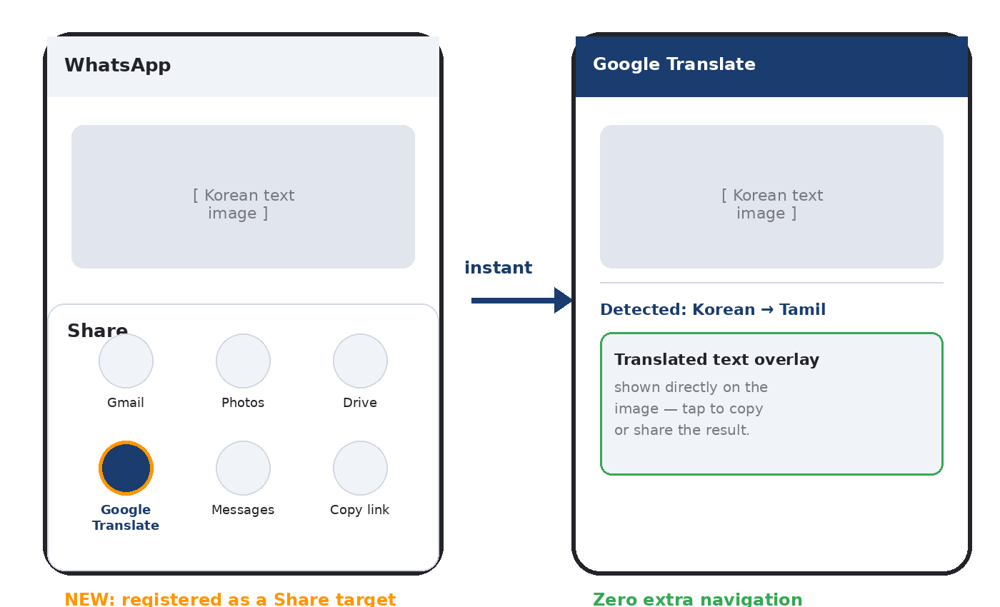

# Share to Google Translate — Closing an Android Workflow Gap

**A product case study proposing that Google Translate register as a native Android Share Sheet target for images.**

---

## The problem, in one line

My father received an image on WhatsApp with Korean text and needed it in Tamil. His reaction stuck with me:

> "I can translate text just fine, but I don't know how to translate an image."

Google Translate already does OCR and translation extremely well — but it isn't reachable from Android's Share menu. So instead of **Share → Translate → done**, users have to leave their chat, open Translate manually, tap Camera, tap Gallery, and hunt down the image. Six steps for something that should take two.

This isn't a one-off observation either — Google's own [Translate Help Community has an open thread requesting this exact feature since 2020](https://support.google.com/translate/thread/63646637/feature-request-photo-translate-in-android-share-menu?hl=en), still unresolved five-plus years later.

## The proposal

Register Google Translate as a native Android image Share target, the same way Gmail and Photos already are — so sharing an image triggers instant OCR + translation, no gallery hunting required.

## What's in this repo

- **[`Share_to_Translate_Case_Study.pdf`](./Share_to_Translate_Case_Study.pdf)** — the full write-up: problem evidence, user personas, competitive analysis (Lens, Gemini, Meta AI, Samsung Translate, Apple Live Text), technical feasibility, privacy considerations, edge cases, success metrics, risk analysis, cost-benefit breakdown, and a proposed research plan (usability study + A/B test design) to validate the idea before any engineering investment.
- **`mockup.png`** — a simple mockup of the proposed Share Sheet flow.

## Why this approach

This proposal deliberately avoids inventing data it doesn't have. Where real evidence exists (the community thread above), it's cited. Where quantitative validation would be needed (exact frequency, time saved, adoption), the case study proposes *how* to measure it rather than asserting numbers — a usability study design and an A/B test structure are laid out in Section 18 of the PDF.

## About

Written by Samyuktaa S V, B.E. Computer Science Engineering (3rd year), as an exercise in product thinking and technical writing.

Feedback welcome — feel free to open an issue or reach out.
